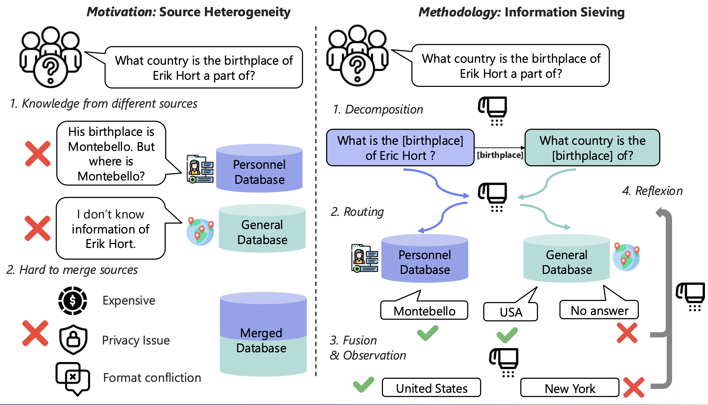
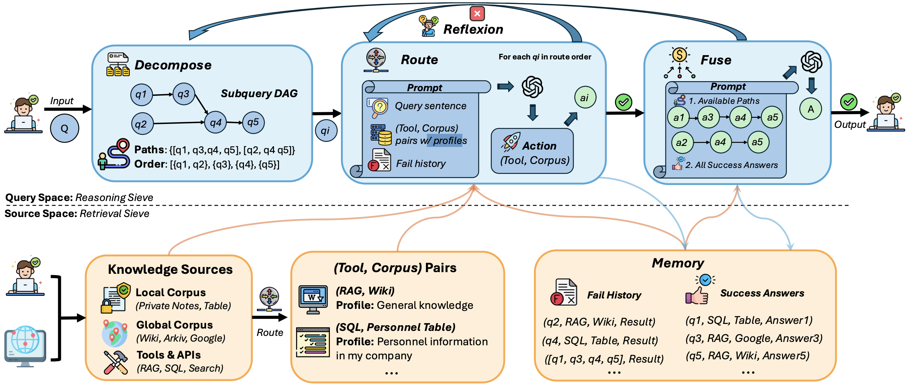

# DeepSieve: Information Sieving via LLM-as-a-Knowledge-Router

> A modular, multi-source, multi-hop RAG framework that decomposes queries, routes subquestions, and fuses answers with reflexive reasoning.

The arxiv link is https://arxiv.org/abs/2507.22050

The website link is https://minghokwok.github.io/deepsieve


## 📰 News
-  2025-07-29 — Uploaded full corpus to Arkiv and released DeepSieve preprint on arXiv
- \[**Jan 2026**\] This paper was accepted by **EACL 2026** Findings 🎉🎉🎉🎉🎉
## 🌐 Overview





**DeepSieve** is a Retrieval-Augmented Generation (RAG) framework designed to handle:
- **Structurally heterogeneous knowledge** (e.g., SQL tables, JSON logs, Wikipedia)
- **Compositional queries** requiring multi-step reasoning
- **Privacy-aware sources** that cannot be merged

DeepSieve introduces a novel _information sieving_ pipeline:
1. **Decompose** complex queries into subquestions
2. **Route** each subquestion to an appropriate tool–corpus pair
3. **Reflect** and retry failed retrievals
4. **Fuse** partial answers into a final response

## 🧠 RAG Pipeline Quickstart

This pipeline implements a modular Retrieval-Augmented Generation (RAG) system with:

- ✅ Query decomposition (`--decompose`)
- ✅ Per-subquestion routing to local/global knowledge (`--use_routing`)
- ✅ Reflection for failed queries (`--use_reflection`)
- ✅ Lightweight RAG backends: `naive` or `graph`
- ✅ Detailed logging & performance tracking

---

## 🔧 Environment Setup

Before running, install dependencies:

```bash
pip install -r requirements.txt
```

Then, export your LLM-related credentials:

```bash
export OPENAI_API_KEY=your_api_key
export OPENAI_MODEL=deepseek-chat
export OPENAI_API_BASE=https://api.deepseek.com/v1  # Optional
```

> For `naive` or `graph` mode, also set:

```bash
export RAG_TYPE=naive      # or graph
```

---

## 🚀 Basic Usage (default: naive mode)

```bash
python runner/main_rag_only.py \
  --dataset hotpot_qa \
  --sample_size 100 \
  --decompose \
  --use_routing \
  --use_reflection \
  --max_reflexion_times 2
```

This runs the full pipeline with:
- Decomposition
- Routing to local/global sources
- Reflection (up to 2 retries)
- Default backend: Naive RAG

---

## ⚙️ Naive RAG Mode (explicit)

```bash
export RAG_TYPE=naive

python runner/main_rag_only.py \
  --dataset hotpot_qa \
  --sample_size 100 \
  --decompose \
  --use_routing \
  --use_reflection \
  --max_reflexion_times 2
```

---

## 🔗 Graph RAG Mode

```bash
export RAG_TYPE=graph

python runner/main_rag_only.py \
  --dataset hotpot_qa \
  --sample_size 100 \
  --decompose \
  --use_routing \
  --use_reflection \
  --max_reflexion_times 2
```


---

## 🧪 Disabling Components

You can toggle modules by removing flags:

- Disable decomposition: remove `--decompose`
- Disable routing: remove `--use_routing`
- Disable reflection: remove `--use_reflection`

---

## 📂 Output

Each run saves:

- Individual results per query:  
  `outputs/{rag_type}_{dataset}*/query_{i}_results.jsonl`

- Fusion prompts:  
  `outputs/.../query_{i}_fusion_prompt.txt`

- Aggregated metrics:  
  `overall_results.txt` and `overall_results.json`

---
## 📚 Citation
If you find this work helpful, please consider citing our paper:
```
@inproceedings{guo2025deepsieve,
  title={DeepSieve: Information Sieving via LLM-as-a-Knowledge-Router},
  author={Guo, Minghao and Zeng, Qingcheng and Zhao, Xujiang and Liu, Yanchi and Yu, Wenchao and Du, Mengnan and Chen, Haifeng and Cheng, Wei},
  booktitle={Findings of the Association for Computational Linguistics: EACL 2026},
  year={2026}
}

@article{guo2025deepsieve,
  title={DeepSieve: Information Sieving via LLM-as-a-Knowledge-Router},
  author={Guo, Minghao and Zeng, Qingcheng and Zhao, Xujiang and Liu, Yanchi and Yu, Wenchao and Du, Mengnan and Chen, Haifeng and Cheng, Wei},
  journal={arXiv preprint arXiv:2507.22050},
  year={2025}
}


```
